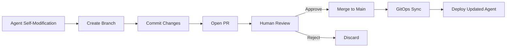

# Self-Evolving AI Agent Systems: Best Practices Research

> Research compiled December 2025 for claude-code-plugin-rest-api

## Executive Summary

This document synthesizes best practices for building self-evolving AI agent systems with zero-downtime deployment capabilities. The research covers seven key areas: self-modifying AI patterns, hot-reload mechanisms, zero-downtime deployment, API gateway options, connection draining, GitOps for agents, and deployment strategies.

---

## 1. Self-Modifying AI Systems

### Core Principles

Self-evolving AI agents can update their own prompts, configurations, and behaviors. The key is implementing **safe, auditable, and reversible** self-modification.

#### The Godel Machine Blueprint
A foundational concept for safe self-improvement: a self-referential program that can rewrite any part of itself **only if it can prove** the change will increase performance. This provides a built-in verification mechanism before committing changes.

**Source**: [ISACA - Risky Code of Self-Modifying AI](https://www.isaca.org/resources/news-and-trends/isaca-now-blog/2025/unseen-unchecked-unraveling-inside-the-risky-code-of-self-modifying-ai)

### Self-Improvement Mechanisms

| Mechanism | Description | Use Case |
|-----------|-------------|----------|
| **Reinforcement Learning** | Rewards for good actions, penalties for bad | Continuous optimization |
| **Human-in-the-Loop (HITL)** | Users rate/correct responses | Quality assurance |
| **Self-Critique & Reflection** | Agent reviews own outputs | Post-task improvement |
| **LLM-as-a-Judge** | LLM evaluates agent outputs | Automated evaluation |

**Source**: [Self-Evolving AI Agents Guide](https://www.xugj520.cn/en/archives/self-evolving-ai-agents-guide.html)

### OpenAI Cookbook: Autonomous Retraining Loop

The recommended approach for production self-evolution:

1. **Capture edge cases** during operation
2. **Learn from feedback** (human + automated)
3. **Promote improvements** back into production workflows

Three strategies ranked by effort vs. automation:
- Manual iteration (quick, human-driven)
- Semi-automated with human review
- Fully automated retraining loops

**Source**: [OpenAI Cookbook - Self-Evolving Agents](https://cookbook.openai.com/examples/partners/self_evolving_agents/autonomous_agent_retraining)

### Safety & Auditing Best Practices

```
Must Have:
- Real-time anomaly detection for unexpected code alterations
- Transparent logs for all self-modifications
- Explainable AI (XAI) techniques for self-evolving systems
- Version control for all prompt/configuration changes

Recommended:
- Modular agent architecture (combine agents for complex workflows)
- Clear objectives and measurable boundaries
- Benchmark with safety tests (AgentHarm, RedCode)

Risk Frameworks:
- NIST AI RMF
- EU AI Act
- OWASP Top 10 for LLMs / Agentic AI
- ISO/IEC 23894:2023
```

**Source**: [UiPath - 10 Best Practices for AI Agents](https://www.uipath.com/blog/ai/agent-builder-best-practices)

---

## 2. Prompt Versioning & Management

### Why Version Prompts?

Prompt versioning ensures **traceability, reproducibility, and controlled rollouts**. It reduces risk, improves reliability, and accelerates iteration cycles.

### Leading Platforms (2025)

| Platform | Key Features |
|----------|--------------|
| **Maxim AI** | Evaluation integration, trajectory-level outcomes |
| **Langfuse** | Open-source, traces & observability |
| **PromptLayer** | Template management, version comparison |
| **Braintrust** | Evaluation-first approach |
| **Humanloop** | A/B testing, deployment management |

**Source**: [Maxim AI - Top 5 Prompt Versioning Tools](https://www.getmaxim.ai/articles/top-5-prompt-versioning-tools-in-2025-essential-infrastructure-for-production-ai-systems/)

### What to Version

Beyond single prompts, version these components:

```yaml
multi_agent_systems:
  - Each role's prompt
  - Coordination policy
  - Trajectory-level outcomes

rag_pipelines:
  - Retrieval instructions
  - Ranking strategies
  - Grounding templates

voice_agents:
  - ASR/NLU prompts
  - System behavior
  - Response style
```

### Production Best Practices

1. **Version everything**: prompts, tools, datasets, evaluations
2. **Gate production release**: only after evaluations pass
3. **Attach evaluations to version tags**: ensure traceability
4. **Feed back into design**: escalations, feedback, logs

**Source**: [LaunchDarkly - Prompt Versioning Guide](https://launchdarkly.com/blog/prompt-versioning-and-management/)

---

## 3. Hot-Reload Patterns for Node.js/NestJS

### NestJS Built-in HMR

NestJS supports Hot Module Replacement via webpack:

```typescript
// main.ts
declare const module: any;

async function bootstrap() {
  const app = await NestFactory.create(AppModule);
  await app.listen(process.env.PORT ?? 3000);

  if (module.hot) {
    module.hot.accept();
    module.hot.dispose(() => app.close());
  }
}
bootstrap();
```

**Configuration**: Add `"start:dev": "nest build --webpack --webpackPath webpack-hmr.config.js --watch"` to package.json.

**Source**: [NestJS Hot Reload Documentation](https://docs.nestjs.com/recipes/hot-reload)

### Dynamic Modules Pattern

For runtime configuration changes without restart:

```typescript
@Module({
  providers: [Connection],
  exports: [Connection],
})
export class DatabaseModule {
  static forRoot(entities = [], options?): DynamicModule {
    const providers = createDatabaseProviders(options, entities);
    return {
      module: DatabaseModule,
      providers: providers,
      exports: providers,
    };
  }
}
```

### Lazy Module Loading

Load modules on-demand at runtime:

```typescript
const { LazyModule } = await import('./lazy.module');
const moduleRef = await this.lazyModuleLoader.load(() => LazyModule);
```

**Source**: [NestJS Dynamic Modules](https://docs.nestjs.com/fundamentals/dynamic-modules)

### File-Based Configuration Hot-Reload

Use **chokidar** (used by 30M+ repositories) for file watching:

```typescript
import chokidar from 'chokidar';

// Watch configuration files
const watcher = chokidar.watch('./config', {
  ignored: ['**/node_modules/**'],
  persistent: true,
  ignoreInitial: true,
});

watcher.on('change', async (path) => {
  console.log(`Config changed: ${path}`);
  await reloadConfiguration(path);
});
```

**Note**: v4+ dropped glob support; use `ignored` callback for filtering.

**Source**: [Chokidar GitHub](https://github.com/paulmillr/chokidar)

### Plugin Hot-Reload Pattern for This Project

```typescript
// Recommended pattern for agent/skill hot-reload
interface HotReloadableConfig {
  agents: Map<string, AgentConfig>;
  skills: Map<string, SkillDefinition>;
  lastReloadTimestamp: number;
}

class ConfigurationReloader {
  private watcher: FSWatcher;

  async initialize(pluginDirectory: string) {
    this.watcher = chokidar.watch(pluginDirectory, {
      ignored: ['**/node_modules/**', '**/.git/**'],
      ignoreInitial: true,
      depth: 3,
    });

    this.watcher.on('change', async (path) => {
      if (path.endsWith('.md') || path.endsWith('.json')) {
        await this.reloadAffectedComponents(path);
      }
    });
  }

  private async reloadAffectedComponents(changedPath: string) {
    // 1. Parse new configuration
    // 2. Validate against schema
    // 3. Atomically swap configuration
    // 4. Emit reload event for active sessions
  }
}
```

---

## 4. Zero-Downtime Deployment Strategies

### Rolling Updates (Kubernetes Default)

```yaml
apiVersion: apps/v1
kind: Deployment
spec:
  strategy:
    type: RollingUpdate
    rollingUpdate:
      maxUnavailable: 1    # At least N-1 pods always running
      maxSurge: 1          # At most N+1 pods during update
```

**Source**: [Kubernetes Rolling Updates](https://kubernetes.io/docs/tutorials/kubernetes-basics/update/update-intro/)

### Critical Configuration: preStop Hook

Ensure load balancers re-route before termination:

```yaml
lifecycle:
  preStop:
    exec:
      command: ["/bin/sh", "-c", "sleep 15"]
```

This 15-second delay allows:
1. Pod removed from endpoints
2. Load balancers reconfigured
3. In-flight requests completed

### Health Checks

```yaml
livenessProbe:
  httpGet:
    path: /health
    port: 3000
  initialDelaySeconds: 10
  periodSeconds: 10

readinessProbe:
  httpGet:
    path: /health/ready
    port: 3000
  initialDelaySeconds: 5
  periodSeconds: 5
```

### PodDisruptionBudget

Guarantee minimum availability during voluntary disruptions:

```yaml
apiVersion: policy/v1
kind: PodDisruptionBudget
metadata:
  name: agent-api-pdb
spec:
  minAvailable: 2  # Or use maxUnavailable: 1
  selector:
    matchLabels:
      app: agent-api
```

**Source**: [Zero-Downtime with Kubernetes](https://www.qovery.com/blog/how-to-achieve-zero-downtime-application-with-kubernetes)

### Blue-Green Deployment

```
Production Traffic
       |
       v
   [Router/LB]
     /     \
    v       v
 [Blue]   [Green]
 (v1.0)   (v1.1)
   |
 Active
```

Instant rollback capability. Higher infrastructure cost (2x).

### Canary Deployment

```
Production Traffic (100%)
       |
       v
   [Router/LB]
     /     \
   95%      5%
    v        v
 [Stable]  [Canary]
  (v1.0)    (v1.1)
```

Gradual rollout. Lower risk. Requires traffic splitting.

**Source**: [Harness - Blue-Green and Canary Explained](https://www.harness.io/blog/blue-green-canary-deployment-strategies)

---

## 5. API Gateway Options for Programmatic Control

### Kong Gateway

**Best For**: Dynamic upstream management, plugin ecosystem

```bash
# Add upstream dynamically via Admin API
curl -X POST http://localhost:8001/upstreams \
  -d name=agent-backend

# Add target to upstream
curl -X POST http://localhost:8001/upstreams/agent-backend/targets \
  -d target=192.168.1.10:3000 \
  -d weight=100
```

**Key Features**:
- Dynamic ring-balancer
- Active + passive health checks
- Automatic failover
- Zero-downtime configuration updates

**Source**: [Kong Upstreams Documentation](https://developer.konghq.com/gateway/entities/upstream/)

### NGINX Plus

**Best For**: Dynamic upstream reconfiguration without reload

```nginx
upstream agent_backend {
    zone agent_backend 64k;  # Required for dynamic config
    server 192.168.1.10:3000;
}
```

```bash
# Add server via API
curl -X POST "http://localhost:8080/api/6/http/upstreams/agent_backend/servers" \
  -d '{"server":"192.168.1.11:3000","weight":1}'
```

**Requirements**:
- `zone` directive mandatory for dynamic reconfiguration
- Changes persist with `state` directive
- Commercial license required

**Source**: [NGINX Plus Dynamic Configuration API](https://docs.nginx.com/nginx/admin-guide/load-balancer/dynamic-configuration-api/)

### OpenResty (NGINX + Lua)

**Best For**: Custom logic, scripting at runtime

```lua
-- balancer_by_lua_block for dynamic upstreams
local balancer = require "ngx.balancer"

local host = get_upstream_from_config()  -- Your logic
local port = 3000

local ok, err = balancer.set_current_peer(host, port)
if not ok then
    ngx.log(ngx.ERR, "failed to set peer: ", err)
end
```

**Key Libraries**:
- `ngx.balancer` - Set upstream dynamically
- `lua-resty-upstream` - Connection pooling, failover
- `lua-resty-healthcheck` - Active/passive health checks

**Source**: [OpenResty Dynamic Upstreams](https://api7.ai/learning-center/openresty/openresty-killer-feature-dynamic)

### Traefik

**Best For**: File-based hot-reload, Kubernetes-native

```yaml
# traefik.yml (static)
providers:
  file:
    directory: /etc/traefik/dynamic
    watch: true  # Hot-reload on file change
```

```yaml
# dynamic/agents.yml
http:
  routers:
    agent-router:
      rule: "PathPrefix(`/v1/agents`)"
      service: agent-service

  services:
    agent-service:
      loadBalancer:
        servers:
          - url: "http://agent-1:3000"
          - url: "http://agent-2:3000"
```

**Key Feature**: Uses fsnotify for seamless hot-reloading without restart.

**Caveat**: Mounted volumes in Docker may break fsnotify; mount parent directory.

**Source**: [Traefik File Provider](https://doc.traefik.io/traefik/providers/file/)

### HAProxy

**Best For**: High-performance, hitless reloads

```haproxy
global
    stats socket /var/run/haproxy.sock mode 660 level admin expose-fd listeners

frontend agent_frontend
    bind *:80
    default_backend agent_backend

backend agent_backend
    server agent1 192.168.1.10:3000 check
    server agent2 192.168.1.11:3000 check
```

**Hitless Reload** (HAProxy 1.8+, Linux 3.9+):

```bash
# Reload with socket transfer
haproxy -f /etc/haproxy/haproxy.cfg -p /var/run/haproxy.pid -sf $(cat /var/run/haproxy.pid)
```

The `expose-fd listeners` option enables socket handoff between old and new processes.

**Source**: [HAProxy Hitless Reloads](https://www.haproxy.com/blog/hitless-reloads-with-haproxy-howto)

### Envoy Proxy

**Best For**: Dynamic xDS API, service mesh integration

**xDS Protocol Components**:
- **CDS**: Cluster Discovery Service
- **EDS**: Endpoint Discovery Service
- **LDS**: Listener Discovery Service
- **RDS**: Route Discovery Service
- **ADS**: Aggregated Discovery Service (atomic updates)

```yaml
# Bootstrap configuration pointing to control plane
dynamic_resources:
  cds_config:
    api_config_source:
      api_type: GRPC
      grpc_services:
        envoy_grpc:
          cluster_name: xds_cluster
```

**Key Advantage**: Hot-reload every aspect except admin, tracing driver, or binary updates.

**Control Plane Options**: Gloo, Istio, Contour, go-control-plane

**Source**: [Envoy xDS Overview](https://www.envoyproxy.io/docs/envoy/latest/intro/arch_overview/operations/dynamic_configuration)

### Comparison Matrix

| Gateway | Dynamic Upstream | Hot Config | Complexity | License |
|---------|-----------------|------------|------------|---------|
| **Kong** | API | API/DB | Medium | OSS/Enterprise |
| **NGINX Plus** | API | API | Low | Commercial |
| **OpenResty** | Lua | Lua | High | OSS |
| **Traefik** | File/API | fsnotify | Low | OSS/Enterprise |
| **HAProxy** | Runtime API | Reload | Medium | OSS/Enterprise |
| **Envoy** | xDS gRPC | Streaming | High | OSS |

---

## 6. Connection Draining for Long-Running Requests

### The Problem

Node.js default behavior kills connections immediately on shutdown. For SSE streams and long-running agent requests, this causes data loss.

### Node.js Graceful Shutdown Pattern

```typescript
import { Server } from 'http';

class GracefulShutdown {
  private connections = new Set<Socket>();
  private isShuttingDown = false;

  constructor(private server: Server, private timeout = 30000) {
    this.trackConnections();
    this.registerSignals();
  }

  private trackConnections() {
    this.server.on('connection', (socket) => {
      this.connections.add(socket);
      socket.on('close', () => this.connections.delete(socket));
    });
  }

  private registerSignals() {
    ['SIGINT', 'SIGTERM'].forEach(signal => {
      process.on(signal, () => this.shutdown());
    });
  }

  async shutdown() {
    if (this.isShuttingDown) return;
    this.isShuttingDown = true;

    console.log('Graceful shutdown initiated...');

    // 1. Stop accepting new connections
    this.server.close();

    // 2. Set timeout for forceful exit
    const forceExit = setTimeout(() => {
      console.log('Force exit after timeout');
      process.exit(1);
    }, this.timeout);

    // 3. Wait for existing connections
    await this.waitForConnections();

    clearTimeout(forceExit);
    process.exit(0);
  }

  private async waitForConnections(): Promise<void> {
    return new Promise((resolve) => {
      const check = setInterval(() => {
        if (this.connections.size === 0) {
          clearInterval(check);
          resolve();
        }
      }, 100);
    });
  }
}
```

**Source**: [Node.js Graceful Shutdown Guide](https://dev.to/nse569h/dont-let-your-nodejs-app-die-ugly-a-guide-to-perfect-graceful-shutdowns-ing)

### http-graceful-shutdown Package

```typescript
import gracefulShutdown from 'http-graceful-shutdown';

const server = app.listen(3000);

gracefulShutdown(server, {
  signals: 'SIGINT SIGTERM',
  timeout: 30000,
  development: false,
  forceExit: true,
  preShutdown: async (signal) => {
    // Called first - prepare for shutdown
    console.log(`Received ${signal}`);
  },
  onShutdown: async () => {
    // Close database connections, flush logs
    await db.close();
    await logger.flush();
  },
  finally: () => {
    console.log('Shutdown complete');
  }
});
```

**Source**: [http-graceful-shutdown npm](https://www.npmjs.com/package/http-graceful-shutdown)

### SSE-Specific Considerations

```typescript
// Track active SSE connections
const activeStreams = new Map<string, Response>();

// On shutdown, notify clients
async function closeSSEConnections() {
  for (const [sessionId, response] of activeStreams) {
    // Send close event to client
    response.write(`event: close\ndata: {"reason":"server_shutdown"}\n\n`);
    response.end();
  }
  activeStreams.clear();
}
```

**Known Issue**: NestJS with `enableShutdownHooks()` may not properly close SSE connections. Test thoroughly.

**Source**: [NestJS SSE Shutdown Issue #9517](https://github.com/nestjs/nest/issues/9517)

### Kubernetes Integration

```yaml
# Coordinate with K8s terminationGracePeriodSeconds
spec:
  terminationGracePeriodSeconds: 60  # Must exceed app timeout
  containers:
    - name: agent-api
      lifecycle:
        preStop:
          exec:
            command: ["/bin/sh", "-c", "sleep 10"]
```

Sequence:
1. Pod receives SIGTERM
2. preStop hook runs (10s)
3. Pod removed from endpoints
4. Application graceful shutdown (up to 50s remaining)
5. SIGKILL after terminationGracePeriodSeconds

**Source**: [RisingStack - Graceful Shutdown with Kubernetes](https://blog.risingstack.com/graceful-shutdown-node-js-kubernetes/)

---

## 7. GitOps for Agent Configuration

### Core Principle

> "Declare desired system state in Git, and have automated agents reconcile the live environment to match that state."

**Source**: [GitLab - What is GitOps?](https://about.gitlab.com/topics/gitops/)

### Git as Source of Truth for Agents

```
repository/
├── agents/
│   ├── code-assistant/
│   │   ├── config.yaml           # Agent configuration
│   │   ├── system-prompt.md      # Versioned prompt
│   │   └── tools.yaml            # Allowed tools
│   └── analyst/
│       ├── config.yaml
│       └── system-prompt.md
├── skills/
│   └── search/
│       └── SKILL.md
└── evaluations/
    ├── test-cases.yaml
    └── benchmarks.yaml
```

### Agent Configuration Schema

```yaml
# agents/code-assistant/config.yaml
apiVersion: agents.example.com/v1
kind: AgentConfig
metadata:
  name: code-assistant
  version: 1.2.3
  annotations:
    last-reviewed: "2025-12-15"
    reviewed-by: "adam@example.com"
spec:
  model: claude-sonnet-4-5
  permissionMode: bypassPermissions
  maxTurns: 20
  maxBudgetUsd: 5.0
  tools:
    type: preset
    preset: claude_code
  systemPromptFile: ./system-prompt.md
```

### Pull-Based Sync with ArgoCD

```yaml
apiVersion: argoproj.io/v1alpha1
kind: Application
metadata:
  name: agent-configs
spec:
  source:
    repoURL: https://github.com/org/agent-configs
    path: agents/
    targetRevision: main
  destination:
    server: https://kubernetes.default.svc
    namespace: agents
  syncPolicy:
    automated:
      prune: true
      selfHeal: true
```

**Source**: [ArgoCD Documentation](https://argo-cd.readthedocs.io/)

### Human-in-the-Loop Git Workflow



### Implementation with LangGraph

```typescript
import { interrupt } from '@langchain/langgraph';

async function agentSelfImproveNode(state: AgentState) {
  const proposedChange = await generatePromptImprovement(state);

  // Create PR for human review
  const prUrl = await createGitPullRequest({
    branch: `agent-improvement-${Date.now()}`,
    title: `Agent self-improvement: ${proposedChange.summary}`,
    body: proposedChange.reasoning,
    files: [{
      path: 'agents/assistant/system-prompt.md',
      content: proposedChange.newPrompt,
    }],
  });

  // Pause execution for human approval
  const approved = await interrupt({
    type: 'approval_required',
    message: `Review proposed change: ${prUrl}`,
  });

  if (!approved) {
    throw new Error('Change rejected by human reviewer');
  }

  return { ...state, promptUpdated: true };
}
```

**Source**: [LangGraph Human-in-the-Loop](https://www.permit.io/blog/human-in-the-loop-for-ai-agents-best-practices-frameworks-use-cases-and-demo)

### Bidirectional Sync

Some platforms offer bidirectional GitOps:
- Changes in Git automatically update production
- Changes via UI commit back to repository

This enforces Git as source of truth while allowing flexibility.

**Source**: [Northflank GitOps Tools](https://northflank.com/blog/gitops-tools)

---

## 8. Recommended Architecture for This Project

### High-Level Design

```
┌─────────────────────────────────────────────────────────────────┐
│                         Git Repository                          │
│  ┌─────────────┐  ┌─────────────┐  ┌─────────────────────────┐  │
│  │   agents/   │  │   skills/   │  │      evaluations/       │  │
│  │ *.yaml, *.md│  │  SKILL.md   │  │   test-cases.yaml       │  │
│  └──────┬──────┘  └──────┬──────┘  └───────────┬─────────────┘  │
└─────────┼────────────────┼─────────────────────┼────────────────┘
          │                │                     │
          └────────────────┼─────────────────────┘
                           │
                    ┌──────▼──────┐
                    │  GitOps     │
                    │  Controller │
                    │  (ArgoCD)   │
                    └──────┬──────┘
                           │
         ┌─────────────────┼─────────────────┐
         │                 │                 │
         ▼                 ▼                 ▼
┌────────────────┐ ┌────────────────┐ ┌────────────────┐
│   Agent Pod 1  │ │   Agent Pod 2  │ │   Agent Pod N  │
│  ┌──────────┐  │ │  ┌──────────┐  │ │  ┌──────────┐  │
│  │ NestJS   │  │ │  │ NestJS   │  │ │  │ NestJS   │  │
│  │ + Config │  │ │  │ + Config │  │ │  │ + Config │  │
│  │ Watcher  │  │ │  │ Watcher  │  │ │  │ Watcher  │  │
│  └──────────┘  │ │  └──────────┘  │ │  └──────────┘  │
└────────┬───────┘ └────────┬───────┘ └────────┬───────┘
         │                  │                  │
         └──────────────────┼──────────────────┘
                            │
                     ┌──────▼──────┐
                     │ Kong/Traefik│
                     │   Gateway   │
                     │  (Dynamic   │
                     │  Upstreams) │
                     └──────┬──────┘
                            │
                     ┌──────▼──────┐
                     │   Clients   │
                     └─────────────┘
```

### Component Responsibilities

| Component | Responsibility |
|-----------|---------------|
| **Git Repository** | Source of truth for agent configs, prompts, skills |
| **GitOps Controller** | Sync repo state to ConfigMaps/Secrets |
| **Config Watcher** | Hot-reload on ConfigMap changes |
| **NestJS App** | Serve agent endpoints, execute Claude SDK |
| **API Gateway** | Dynamic routing, health checks, traffic management |

### Implementation Phases

#### Phase 1: Configuration Hot-Reload
- Implement chokidar-based file watcher
- Atomic configuration swapping
- Graceful handling of active sessions

#### Phase 2: GitOps Integration
- Store agent configs in Git
- Set up ArgoCD/Flux for sync
- Map to ConfigMaps

#### Phase 3: Self-Evolution Pipeline
- Agent proposes changes via PR
- Human review gate
- Automated evaluation on merge
- Rollback on regression

#### Phase 4: Zero-Downtime Infrastructure
- Kong/Traefik with dynamic upstreams
- Kubernetes rolling updates with PDB
- Graceful shutdown for SSE connections

---

## Sources

### Self-Modifying AI Systems
- [ISACA - Risky Code of Self-Modifying AI](https://www.isaca.org/resources/news-and-trends/isaca-now-blog/2025/unseen-unchecked-unraveling-inside-the-risky-code-of-self-modifying-ai)
- [Self-Evolving AI Agents Guide](https://www.xugj520.cn/en/archives/self-evolving-ai-agents-guide.html)
- [UiPath - 10 Best Practices for AI Agents](https://www.uipath.com/blog/ai/agent-builder-best-practices)
- [OpenAI Cookbook - Self-Evolving Agents](https://cookbook.openai.com/examples/partners/self_evolving_agents/autonomous_agent_retraining)

### Prompt Versioning
- [Maxim AI - Top 5 Prompt Versioning Tools](https://www.getmaxim.ai/articles/top-5-prompt-versioning-tools-in-2025-essential-infrastructure-for-production-ai-systems/)
- [LaunchDarkly - Prompt Versioning Guide](https://launchdarkly.com/blog/prompt-versioning-and-management/)
- [PromptLayer](https://www.promptlayer.com/)

### Hot-Reload Patterns
- [NestJS Hot Reload Documentation](https://docs.nestjs.com/recipes/hot-reload)
- [NestJS Dynamic Modules](https://docs.nestjs.com/fundamentals/dynamic-modules)
- [Chokidar GitHub](https://github.com/paulmillr/chokidar)

### Zero-Downtime Deployment
- [Kubernetes Rolling Updates](https://kubernetes.io/docs/tutorials/kubernetes-basics/update/update-intro/)
- [Zero-Downtime with Kubernetes](https://www.qovery.com/blog/how-to-achieve-zero-downtime-application-with-kubernetes)
- [Harness - Blue-Green and Canary Explained](https://www.harness.io/blog/blue-green-canary-deployment-strategies)

### API Gateways
- [Kong Upstreams Documentation](https://developer.konghq.com/gateway/entities/upstream/)
- [NGINX Plus Dynamic Configuration API](https://docs.nginx.com/nginx/admin-guide/load-balancer/dynamic-configuration-api/)
- [OpenResty Dynamic Upstreams](https://api7.ai/learning-center/openresty/openresty-killer-feature-dynamic)
- [Traefik File Provider](https://doc.traefik.io/traefik/providers/file/)
- [HAProxy Hitless Reloads](https://www.haproxy.com/blog/hitless-reloads-with-haproxy-howto)
- [Envoy xDS Overview](https://www.envoyproxy.io/docs/envoy/latest/intro/arch_overview/operations/dynamic_configuration)

### Connection Draining
- [Node.js Graceful Shutdown Guide](https://dev.to/nse569h/dont-let-your-nodejs-app-die-ugly-a-guide-to-perfect-graceful-shutdowns-ing)
- [http-graceful-shutdown npm](https://www.npmjs.com/package/http-graceful-shutdown)
- [RisingStack - Graceful Shutdown with Kubernetes](https://blog.risingstack.com/graceful-shutdown-node-js-kubernetes/)

### GitOps
- [GitLab - What is GitOps?](https://about.gitlab.com/topics/gitops/)
- [Scalr - Top 10 GitOps Tools](https://scalr.com/learning-center/top-10-gitops-tools-for-2025-a-comprehensive-guide/)
- [Permit.io - Human-in-the-Loop for AI Agents](https://www.permit.io/blog/human-in-the-loop-for-ai-agents-best-practices-frameworks-use-cases-and-demo)
